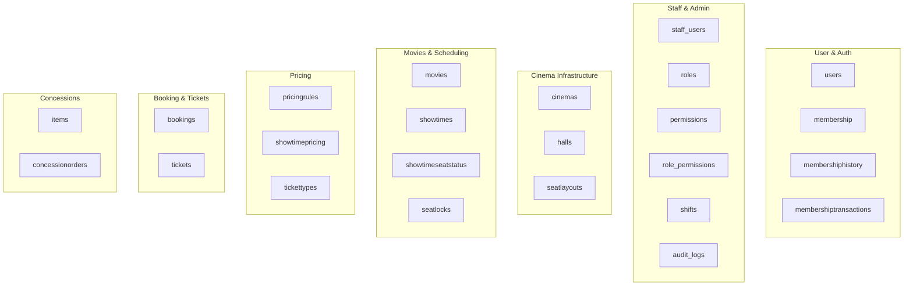
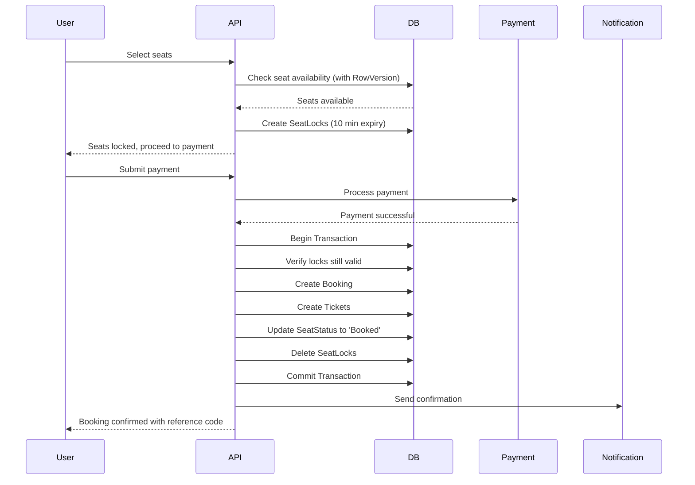

# 🎬 Movie Reservation System - Functional Requirements Specification

> **Version**: 1.0  
> **Technology Stack**: ASP.NET Core (Backend) + React (Web) + React Native (Mobile)  
> **Architecture**: RESTful API with MVC Pattern  
> **Last Updated**: January 2026

---

## 📋 Table of Contents

1. [System Overview](#1-system-overview)
2. [Common Industry Challenges & Solutions](#2-common-industry-challenges--solutions)
3. [Unified ERD Overview](#3-unified-erd-overview)
4. [Module 1: User & Authentication](#4-module-1-user--authentication)
5. [Module 2: Cinema & Infrastructure](#5-module-2-cinema--infrastructure)
6. [Module 3: Movie & Showtime Management](#6-module-3-movie--showtime-management)
7. [Module 4: Seat Reservation & Booking](#7-module-4-seat-reservation--booking)
8. [Module 5: Pricing Engine](#8-module-5-pricing-engine)
9. [Module 6: Concessions (F&B)](#9-module-6-concessions-fb)
10. [Module 7: Membership & Loyalty](#10-module-7-membership--loyalty)
11. [Module 8: Staff & Administration](#11-module-8-staff--administration)
12. [Module 9: Reporting & Analytics](#12-module-9-reporting--analytics)
13. [API Architecture Overview](#13-api-architecture-overview)
14. [Non-Functional Requirements](#14-non-functional-requirements)

---

## 1. System Overview

### 1.1 Purpose

This document defines the comprehensive functional requirements for an **Enterprise-Level Movie Reservation System** that supports:

- **Web Application** (React)
- **Mobile Application** (React Native - iOS & Android)
- **Admin Dashboard** (React)
- **Staff Portal** (React)

### 1.2 System Goals

| Goal | Description |
|------|-------------|
| **Unified Platform** | Single backend serving web, mobile, and admin interfaces |
| **Real-time Seat Management** | Prevent double booking with optimistic concurrency control |
| **Scalable Architecture** | Handle peak loads during popular movie releases |
| **Secure Transactions** | PCI-DSS compliant payment processing |
| **Membership Integration** | Loyalty points, tier benefits, member discounts |

### 1.3 User Roles

| Role | Description | Access Level |
|------|-------------|--------------|
| **Guest** | Unregistered visitor | Browse movies, view showtimes |
| **Customer** | Registered user | Book tickets, manage reservations, earn points |
| **Member** | Premium customer | Tier benefits, exclusive discounts, priority booking |
| **Staff** | Cinema employee | POS operations, ticket validation, customer service |
| **Manager** | Cinema manager | Staff management, reporting, inventory control |
| **Admin** | System administrator | Full system access, configuration, user management |

---

## 2. Common Industry Challenges & Solutions

> [!IMPORTANT]
> These are critical problems that **MUST** be addressed in the system design.

### 2.1 Identified Problems

| # | Challenge | Description | Impact |
|---|-----------|-------------|--------|
| 1 | **Double Booking (Race Condition)** | Multiple users selecting the same seat simultaneously | Overbooking, customer complaints, refund costs |
| 2 | **Seat Lock Timeout** | Users abandon booking mid-process, seats remain locked | Lost revenue, reduced inventory |
| 3 | **Concurrency Control** | High traffic during popular movie releases | System crashes, failed transactions |
| 4 | **Real-time Availability** | Inconsistent seat status across platforms | User confusion, booking failures |
| 5 | **Payment Failures** | Transaction interruptions after seat selection | Orphan reservations, inventory inconsistency |
| 6 | **Peak Load Handling** | Scalability during high-demand periods | Slow response, system downtime |
| 7 | **Mobile App Stability** | Seat selection and payment issues on mobile | Poor user experience, lost sales |

### 2.2 Proposed Solutions (Implemented in Design)

| Challenge | Solution | Implementation |
|-----------|----------|----------------|
| Double Booking | **Optimistic Concurrency Control** | `RowVersion` field in `ShowtimeSeatStatus` table |
| Seat Lock Timeout | **Temporary Seat Locks** | `SeatLocks` table with `LockExpirationTime` (5-15 min) |
| Concurrency | **Distributed Locking** | Redis-based lock mechanism for high-traffic scenarios |
| Real-time Sync | **SignalR WebSocket** | Push updates to all connected clients |
| Payment Failures | **Two-Phase Commit** | Separate lock → confirm flow with rollback |
| Peak Load | **Horizontal Scaling** | Stateless API design, load balancing |
| Mobile Stability | **Optimistic UI Updates** | Client-side prediction with server reconciliation |

---

## 3. Unified ERD Overview

> [!NOTE]
> The following ERD combines both **Customer-facing** and **Admin/Staff** schemas into a single unified system.

### 3.1 Entity Groups



### 3.2 Complete Entity Relationship Table

| Entity | Primary Key | Foreign Keys | Relationship |
|--------|-------------|--------------|--------------|
| `users` | UserID | - | Base user for customers AND staff |
| `staff_users` | StaffID | UserID, RoleID | 1 User → 0..1 StaffUser |
| `membership` | MemberID | UserID | 1 User → 0..1 Membership |
| `cinemas` | CinemaID | - | Top-level entity |
| `halls` | HallID | CinemaID | 1 Cinema → Many Halls |
| `seatlayouts` | SeatID | HallID | 1 Hall → Many Seats |
| `movies` | MovieID | - | Independent entity |
| `showtimes` | ShowtimeID | MovieID, HallID | Many-to-Many bridge |
| `showtimeseatstatus` | ShowtimeSeatID | ShowtimeID, SeatID | Per-showtime seat state |
| `seatlocks` | LockID | ShowtimeSeatID, UserID | Temporary reservation |
| `bookings` | BookingID | UserID | 1 User → Many Bookings |
| `tickets` | TicketID | BookingID, ShowtimeSeatID, TicketTypeID | 1 Booking → Many Tickets |

---

## 4. Module 1: User & Authentication

### 4.1 Overview

| Aspect | Details |
|--------|---------|
| **Purpose** | Manage user registration, authentication, and authorization |
| **Entities** | `users`, `staff_users`, `roles`, `permissions`, `role_permissions` |
| **API Controller** | `AuthController`, `UsersController` |

### 4.2 Functional Requirements

#### 4.2.1 User Registration

| ID | Requirement | Priority | User Story |
|----|-------------|----------|------------|
| AUTH-001 | System shall allow users to register with email and password | High | As a guest, I want to create an account to book tickets |
| AUTH-002 | System shall validate email format and uniqueness | High | As a system, I want to prevent duplicate accounts |
| AUTH-003 | System shall hash passwords using bcrypt/Argon2 | High | As a security requirement, passwords must be securely stored |
| AUTH-004 | System shall send email verification upon registration | Medium | As a user, I want to verify my email for account recovery |
| AUTH-005 | System shall support social login (Google, Facebook) | Low | As a user, I want quick registration via social accounts |

#### 4.2.2 Authentication

| ID | Requirement | Priority | User Story |
|----|-------------|----------|------------|
| AUTH-010 | System shall authenticate users via JWT tokens | High | As the API, I need stateless authentication |
| AUTH-011 | System shall issue access token (15 min) and refresh token (7 days) | High | As a user, I want to stay logged in securely |
| AUTH-012 | System shall support token refresh without re-login | High | As a user, I don't want to login repeatedly |
| AUTH-013 | System shall invalidate tokens on logout | High | As a security requirement, logout must be effective |
| AUTH-014 | System shall lock accounts after 5 failed login attempts | Medium | As a security measure, prevent brute force attacks |

#### 4.2.3 Authorization (Role-Based Access Control)

| ID | Requirement | Priority | User Story |
|----|-------------|----------|------------|
| AUTH-020 | System shall enforce role-based access control (RBAC) | High | As an admin, I want to control user permissions |
| AUTH-021 | System shall support granular permissions per role | High | As a manager, I need specific capabilities |
| AUTH-022 | System shall allow admins to create custom roles | Medium | As an admin, I want flexible role management |
| AUTH-023 | System shall log all permission-sensitive actions | High | As an auditor, I need action traceability |

### 4.3 API Endpoints

| Method | Endpoint | Description | Auth Required | Roles |
|--------|----------|-------------|---------------|-------|
| POST | `/api/auth/register` | Register new user | No | Guest |
| POST | `/api/auth/login` | User login | No | Guest |
| POST | `/api/auth/refresh` | Refresh access token | Yes | All |
| POST | `/api/auth/logout` | Invalidate tokens | Yes | All |
| POST | `/api/auth/forgot-password` | Request password reset | No | Guest |
| POST | `/api/auth/reset-password` | Reset password with token | No | Guest |
| GET | `/api/users/profile` | Get current user profile | Yes | All |
| PUT | `/api/users/profile` | Update user profile | Yes | All |
| GET | `/api/users` | List all users | Yes | Admin |
| PUT | `/api/users/{id}/role` | Update user role | Yes | Admin |

### 4.4 Database Schema

```sql
-- Users Table (Unified for Customers and Staff)
CREATE TABLE users (
    id              VARCHAR(36) PRIMARY KEY,
    username        VARCHAR(50) UNIQUE NOT NULL,
    email           VARCHAR(100) UNIQUE NOT NULL,
    password_hash   VARCHAR(255) NOT NULL,
    phone           VARCHAR(20),
    created_at      TIMESTAMP DEFAULT CURRENT_TIMESTAMP,
    last_login      TIMESTAMP,
    status          VARCHAR(20) DEFAULT 'active', -- active, suspended, deleted
    email_verified  BOOLEAN DEFAULT FALSE
);

-- Staff Users Extension
CREATE TABLE staff_users (
    id          VARCHAR(36) PRIMARY KEY,
    user_id     VARCHAR(36) REFERENCES users(id),
    role_id     VARCHAR(36) REFERENCES roles(id),
    hire_date   DATE NOT NULL,
    status      VARCHAR(20) DEFAULT 'active'
);

-- Roles
CREATE TABLE roles (
    id          VARCHAR(36) PRIMARY KEY,
    name        VARCHAR(50) UNIQUE NOT NULL,
    description TEXT
);

-- Permissions
CREATE TABLE permissions (
    id          VARCHAR(36) PRIMARY KEY,
    name        VARCHAR(100) UNIQUE NOT NULL,
    description TEXT
);

-- Role-Permission Mapping
CREATE TABLE role_permissions (
    id              VARCHAR(36) PRIMARY KEY,
    role_id         VARCHAR(36) REFERENCES roles(id),
    permission_id   VARCHAR(36) REFERENCES permissions(id),
    UNIQUE(role_id, permission_id)
);
```

---

## 5. Module 2: Cinema & Infrastructure

### 5.1 Overview

| Aspect | Details |
|--------|---------|
| **Purpose** | Manage cinema locations, halls, and physical seat layouts |
| **Entities** | `cinemas`, `halls`, `seatlayouts` |
| **API Controller** | `CinemasController`, `HallsController`, `SeatsController` |

### 5.2 Functional Requirements

#### 5.2.1 Cinema Management

| ID | Requirement | Priority | User Story |
|----|-------------|----------|------------|
| CIN-001 | Admin shall be able to add new cinema locations | High | As an admin, I want to expand to new locations |
| CIN-002 | System shall store cinema name, address, and contact info | High | As a user, I want to find nearby cinemas |
| CIN-003 | System shall track total halls per cinema | Medium | As a manager, I need capacity overview |
| CIN-004 | System shall support cinema status (open, closed, maintenance) | Medium | As an admin, I can temporarily close locations |

#### 5.2.2 Hall Management

| ID | Requirement | Priority | User Story |
|----|-------------|----------|------------|
| HALL-001 | Admin shall create halls within a cinema | High | As an admin, I want to set up screening rooms |
| HALL-002 | System shall support screen types (Standard, IMAX, 4DX, Dolby) | High | As a user, I want premium viewing options |
| HALL-003 | System shall track seating capacity per hall | High | As a manager, I need capacity planning |
| HALL-004 | System shall allow hall status management | Medium | As a manager, I can mark halls for maintenance |

#### 5.2.3 Seat Layout Management

| ID | Requirement | Priority | User Story |
|----|-------------|----------|------------|
| SEAT-001 | Admin shall define seat layouts per hall | High | As an admin, I want to configure seating arrangements |
| SEAT-002 | System shall support seat types (Standard, VIP, Couple, Wheelchair) | High | As a user, I want seat options based on preference |
| SEAT-003 | System shall store grid position (X, Y) for visual mapping | High | As a frontend, I need coordinates for seat map |
| SEAT-004 | System shall support row labels (A, B, C...) and seat numbers | High | As a user, I want identifiable seat locations |
| SEAT-005 | Admin shall be able to mark seats as unavailable permanently | Medium | As an admin, I can remove damaged seats |

### 5.3 API Endpoints

| Method | Endpoint | Description | Auth Required | Roles |
|--------|----------|-------------|---------------|-------|
| GET | `/api/cinemas` | List all cinemas | No | All |
| GET | `/api/cinemas/{id}` | Get cinema details | No | All |
| POST | `/api/cinemas` | Create cinema | Yes | Admin |
| PUT | `/api/cinemas/{id}` | Update cinema | Yes | Admin |
| DELETE | `/api/cinemas/{id}` | Delete cinema | Yes | Admin |
| GET | `/api/cinemas/{id}/halls` | Get halls in cinema | No | All |
| POST | `/api/halls` | Create hall | Yes | Admin |
| PUT | `/api/halls/{id}` | Update hall | Yes | Admin |
| GET | `/api/halls/{id}/seats` | Get seat layout | No | All |
| POST | `/api/halls/{id}/seats` | Configure seats | Yes | Admin |
| PUT | `/api/seats/{id}` | Update seat | Yes | Admin |

### 5.4 Database Schema

```sql
-- Cinemas
CREATE TABLE cinemas (
    cinema_id   VARCHAR(36) PRIMARY KEY,
    name        VARCHAR(100) NOT NULL,
    location    TEXT NOT NULL,
    address     TEXT,
    phone       VARCHAR(20),
    email       VARCHAR(100),
    total_halls INT DEFAULT 0,
    status      VARCHAR(20) DEFAULT 'active',
    created_at  TIMESTAMP DEFAULT CURRENT_TIMESTAMP
);

-- Halls
CREATE TABLE halls (
    hall_id           VARCHAR(36) PRIMARY KEY,
    cinema_id         VARCHAR(36) REFERENCES cinemas(cinema_id),
    name              VARCHAR(50) NOT NULL,
    screen_type       VARCHAR(30) NOT NULL, -- Standard, IMAX, 4DX, Dolby
    seating_capacity  INT NOT NULL,
    status            VARCHAR(20) DEFAULT 'active',
    UNIQUE(cinema_id, name)
);

-- Seat Layouts (Physical Seats)
CREATE TABLE seatlayouts (
    seat_id       VARCHAR(36) PRIMARY KEY,
    hall_id       VARCHAR(36) REFERENCES halls(hall_id),
    row_label     CHAR(2) NOT NULL,
    seat_number   INT NOT NULL,
    seat_type     VARCHAR(20) NOT NULL, -- Standard, VIP, Couple, Wheelchair
    grid_x        INT NOT NULL,
    grid_y        INT NOT NULL,
    is_available  BOOLEAN DEFAULT TRUE,
    UNIQUE(hall_id, row_label, seat_number)
);
```

---

## 6. Module 3: Movie & Showtime Management

### 6.1 Overview

| Aspect | Details |
|--------|---------|
| **Purpose** | Manage movie catalog and scheduling of showtimes |
| **Entities** | `movies`, `showtimes`, `showtimeseatstatus` |
| **API Controller** | `MoviesController`, `ShowtimesController` |

### 6.2 Functional Requirements

#### 6.2.1 Movie Management

| ID | Requirement | Priority | User Story |
|----|-------------|----------|------------|
| MOV-001 | Admin shall add movies with title, description, poster | High | As an admin, I want to add new releases |
| MOV-002 | System shall store movie duration in minutes | High | As a scheduler, I need duration for showtime planning |
| MOV-003 | System shall support movie ratings (G, PG, PG-13, R, NC-17) | High | As a user, I want age-appropriate filtering |
| MOV-004 | System shall categorize movies by genre | Medium | As a user, I want to browse by genre |
| MOV-005 | System shall track release date for scheduling | High | As an admin, I can plan premieres |
| MOV-006 | System shall support movie status (Coming Soon, Now Showing, Ended) | High | As a user, I want current movies only |
| MOV-007 | System shall store trailer URLs | Low | As a user, I want to watch trailers |

#### 6.2.2 Showtime Management

| ID | Requirement | Priority | User Story |
|----|-------------|----------|------------|
| SHW-001 | Admin shall schedule showtimes for movies in specific halls | High | As an admin, I want to create screening schedules |
| SHW-002 | System shall prevent overlapping showtimes in same hall | High | As a scheduler, I need conflict detection |
| SHW-003 | System shall auto-calculate end time based on movie duration | High | As a scheduler, end times should be automatic |
| SHW-004 | System shall require buffer time between showtimes (15-30 min) | Medium | As operations, we need cleaning time |
| SHW-005 | User shall browse showtimes by date, cinema, and movie | High | As a user, I want flexible showtime search |
| SHW-006 | System shall support showtime status (Scheduled, Cancelled, Ended) | High | As a user, I need accurate availability |

#### 6.2.3 Showtime Seat Status (Core Inventory)

| ID | Requirement | Priority | User Story |
|----|-------------|----------|------------|
| SSS-001 | System shall create seat status records when showtime is created | High | As a system, I need per-showtime inventory |
| SSS-002 | System shall track seat status (Available, Locked, Booked) | High | As a user, I need real-time availability |
| SSS-003 | System shall implement RowVersion for concurrency control | High | As a system, I must prevent double booking |
| SSS-004 | System shall support real-time status updates via WebSocket | High | As a user, I want live seat updates |

### 6.3 API Endpoints

| Method | Endpoint | Description | Auth Required | Roles |
|--------|----------|-------------|---------------|-------|
| GET | `/api/movies` | List movies (filterable) | No | All |
| GET | `/api/movies/{id}` | Get movie details | No | All |
| POST | `/api/movies` | Create movie | Yes | Admin |
| PUT | `/api/movies/{id}` | Update movie | Yes | Admin |
| DELETE | `/api/movies/{id}` | Delete movie | Yes | Admin |
| GET | `/api/movies/{id}/showtimes` | Get showtimes for movie | No | All |
| GET | `/api/showtimes` | List showtimes (by date/cinema) | No | All |
| GET | `/api/showtimes/{id}` | Get showtime details | No | All |
| POST | `/api/showtimes` | Create showtime | Yes | Admin, Manager |
| PUT | `/api/showtimes/{id}` | Update showtime | Yes | Admin, Manager |
| DELETE | `/api/showtimes/{id}` | Cancel showtime | Yes | Admin, Manager |
| GET | `/api/showtimes/{id}/seats` | Get seat availability | No | All |

### 6.4 Database Schema

```sql
-- Movies
CREATE TABLE movies (
    movie_id      VARCHAR(36) PRIMARY KEY,
    title         VARCHAR(200) NOT NULL,
    description   TEXT,
    duration      INT NOT NULL, -- minutes
    rating        VARCHAR(10), -- G, PG, PG-13, R, NC-17
    genre         VARCHAR(50),
    release_date  DATE,
    poster_url    TEXT,
    trailer_url   TEXT,
    status        VARCHAR(20) DEFAULT 'coming_soon', -- coming_soon, now_showing, ended
    created_at    TIMESTAMP DEFAULT CURRENT_TIMESTAMP
);

-- Showtimes
CREATE TABLE showtimes (
    showtime_id   VARCHAR(36) PRIMARY KEY,
    movie_id      VARCHAR(36) REFERENCES movies(movie_id),
    hall_id       VARCHAR(36) REFERENCES halls(hall_id),
    start_time    TIMESTAMP NOT NULL,
    end_time      TIMESTAMP NOT NULL,
    status        VARCHAR(20) DEFAULT 'scheduled', -- scheduled, cancelled, ended
    created_at    TIMESTAMP DEFAULT CURRENT_TIMESTAMP,
    UNIQUE(hall_id, start_time)
);

-- Showtime Seat Status (Per-Showtime Inventory)
CREATE TABLE showtimeseatstatus (
    showtime_seat_id  VARCHAR(36) PRIMARY KEY,
    showtime_id       VARCHAR(36) REFERENCES showtimes(showtime_id),
    seat_id           VARCHAR(36) REFERENCES seatlayouts(seat_id),
    status            VARCHAR(20) DEFAULT 'available', -- available, locked, booked
    row_version       INT DEFAULT 1, -- Optimistic Concurrency Control
    UNIQUE(showtime_id, seat_id)
);

-- Index for performance
CREATE INDEX idx_showtimes_date ON showtimes(start_time);
CREATE INDEX idx_seat_status ON showtimeseatstatus(showtime_id, status);
```

---

## 7. Module 4: Seat Reservation & Booking

### 7.1 Overview

| Aspect | Details |
|--------|---------|
| **Purpose** | Handle seat locking, booking creation, and ticket generation |
| **Entities** | `seatlocks`, `bookings`, `tickets` |
| **API Controller** | `BookingsController`, `TicketsController` |
| **Special Handling** | Concurrency control, payment integration |

### 7.2 Functional Requirements

#### 7.2.1 Seat Locking (Temporary Reservation)

| ID | Requirement | Priority | User Story |
|----|-------------|----------|------------|
| LOCK-001 | User shall be able to lock seats for temporary hold | High | As a user, I want seats held while I pay |
| LOCK-002 | System shall set lock expiration (default: 10 minutes) | High | As a system, I prevent indefinite locks |
| LOCK-003 | System shall automatically release expired locks | High | As a system, I reclaim abandoned seats |
| LOCK-004 | System shall prevent locking already locked/booked seats | High | As a system, I prevent conflicts |
| LOCK-005 | System shall use RowVersion check when locking | High | As a system, I handle race conditions |
| LOCK-006 | User shall be able to extend lock duration once | Low | As a user, I may need more time |

#### 7.2.2 Booking Creation

| ID | Requirement | Priority | User Story |
|----|-------------|----------|------------|
| BOOK-001 | User shall create booking after successful payment | High | As a user, I want confirmed reservations |
| BOOK-002 | System shall generate unique booking reference code | High | As a user, I need a booking reference |
| BOOK-003 | System shall calculate total amount from ticket prices | High | As a system, I must track revenue |
| BOOK-004 | System shall update seat status to 'Booked' on confirmation | High | As a system, I update inventory |
| BOOK-005 | System shall send booking confirmation via email/SMS | Medium | As a user, I want confirmation receipt |
| BOOK-006 | System shall support booking cancellation (before showtime) | High | As a user, I may need to cancel |
| BOOK-007 | System shall enforce cancellation policy (24h before) | Medium | As a business rule, limit late cancellations |

#### 7.2.3 Ticket Management

| ID | Requirement | Priority | User Story |
|----|-------------|----------|------------|
| TKT-001 | System shall generate individual tickets per seat booked | High | As a system, I need granular ticket records |
| TKT-002 | System shall link tickets to ticket types (Adult, Child, Student, Senior) | High | As a user, I select appropriate ticket types |
| TKT-003 | System shall calculate final price per ticket | High | As a system, I track individual pricing |
| TKT-004 | System shall generate QR code for ticket validation | High | As a user, I need scannable entry tickets |
| TKT-005 | User shall view and download tickets in mobile app | High | As a user, I want digital tickets |
| TKT-006 | Staff shall validate tickets via QR scan at entry | High | As staff, I verify ticket authenticity |

### 7.3 Booking Flow Diagram



### 7.4 API Endpoints

| Method | Endpoint | Description | Auth Required | Roles |
|--------|----------|-------------|---------------|-------|
| POST | `/api/bookings/lock-seats` | Lock seats temporarily | Yes | Customer |
| DELETE | `/api/bookings/unlock-seats` | Release locked seats | Yes | Customer |
| POST | `/api/bookings` | Create booking (after payment) | Yes | Customer |
| GET | `/api/bookings` | List user's bookings | Yes | Customer |
| GET | `/api/bookings/{id}` | Get booking details | Yes | Customer, Staff |
| DELETE | `/api/bookings/{id}` | Cancel booking | Yes | Customer |
| GET | `/api/bookings/{id}/tickets` | Get tickets for booking | Yes | Customer |
| POST | `/api/tickets/validate` | Validate ticket QR code | Yes | Staff |
| GET | `/api/tickets/{id}/qr` | Generate QR code | Yes | Customer |

### 7.5 Database Schema

```sql
-- Seat Locks (Temporary Reservations)
CREATE TABLE seatlocks (
    lock_id               VARCHAR(36) PRIMARY KEY,
    showtime_seat_id      VARCHAR(36) REFERENCES showtimeseatstatus(showtime_seat_id),
    user_id               VARCHAR(36) REFERENCES users(id),
    lock_expiration_time  TIMESTAMP NOT NULL,
    created_at            TIMESTAMP DEFAULT CURRENT_TIMESTAMP,
    UNIQUE(showtime_seat_id) -- Only one lock per seat
);

-- Bookings
CREATE TABLE bookings (
    booking_id              VARCHAR(36) PRIMARY KEY,
    user_id                 VARCHAR(36) REFERENCES users(id),
    total_amount            DECIMAL(10, 2) NOT NULL,
    payment_status          VARCHAR(20) DEFAULT 'pending', -- pending, paid, refunded
    booking_reference_code  VARCHAR(20) UNIQUE NOT NULL,
    status                  VARCHAR(20) DEFAULT 'confirmed', -- confirmed, cancelled, completed
    created_at              TIMESTAMP DEFAULT CURRENT_TIMESTAMP
);

-- Tickets
CREATE TABLE tickets (
    ticket_id         VARCHAR(36) PRIMARY KEY,
    booking_id        VARCHAR(36) REFERENCES bookings(booking_id),
    showtime_seat_id  VARCHAR(36) REFERENCES showtimeseatstatus(showtime_seat_id),
    ticket_type_id    VARCHAR(36) REFERENCES tickettypes(type_id),
    final_price       DECIMAL(10, 2) NOT NULL,
    qr_code           TEXT,
    is_used           BOOLEAN DEFAULT FALSE,
    used_at           TIMESTAMP,
    UNIQUE(showtime_seat_id) -- One ticket per seat per showtime
);

-- Index for lock cleanup job
CREATE INDEX idx_lock_expiry ON seatlocks(lock_expiration_time);
```

---

## 8. Module 5: Pricing Engine

### 8.1 Overview

| Aspect | Details |
|--------|---------|
| **Purpose** | Dynamic pricing based on time, day, seat type, and promotions |
| **Entities** | `tickettypes`, `pricingrules`, `showtimepricing` |
| **API Controller** | `PricingController` |

### 8.2 Functional Requirements

#### 8.2.1 Ticket Types

| ID | Requirement | Priority | User Story |
|----|-------------|----------|------------|
| PRC-001 | System shall support ticket types (Adult, Child, Student, Senior) | High | As a user, I select my ticket category |
| PRC-002 | Each ticket type shall have a default price multiplier | High | As a system, I calculate prices automatically |
| PRC-003 | Admin shall configure ticket type availability per showtime | Medium | As an admin, I can limit student tickets |

#### 8.2.2 Pricing Rules

| ID | Requirement | Priority | User Story |
|----|-------------|----------|------------|
| PRC-010 | Admin shall create pricing rules based on day of week | High | As an admin, I set weekend pricing |
| PRC-011 | Admin shall create pricing rules based on time ranges | High | As an admin, I set matinee discounts |
| PRC-012 | System shall apply seat type surcharges (VIP, Couple) | High | As a system, premium seats cost more |
| PRC-013 | System shall support promotional discounts | Medium | As marketing, I can run promotions |
| PRC-014 | System shall calculate final price from base + adjustments | High | As a system, I compute accurate pricing |

#### 8.2.3 Showtime Pricing Application

| ID | Requirement | Priority | User Story |
|----|-------------|----------|------------|
| PRC-020 | System shall link pricing rules to specific showtimes | High | As a system, I apply relevant rules |
| PRC-021 | Admin shall override pricing for specific showtimes | Medium | As an admin, I can set premiere pricing |
| PRC-022 | System shall display calculated price during seat selection | High | As a user, I see prices before paying |

### 8.3 API Endpoints

| Method | Endpoint | Description | Auth Required | Roles |
|--------|----------|-------------|---------------|-------|
| GET | `/api/ticket-types` | List ticket types | No | All |
| POST | `/api/ticket-types` | Create ticket type | Yes | Admin |
| PUT | `/api/ticket-types/{id}` | Update ticket type | Yes | Admin |
| GET | `/api/pricing-rules` | List pricing rules | Yes | Admin, Manager |
| POST | `/api/pricing-rules` | Create pricing rule | Yes | Admin |
| PUT | `/api/pricing-rules/{id}` | Update pricing rule | Yes | Admin |
| DELETE | `/api/pricing-rules/{id}` | Delete pricing rule | Yes | Admin |
| GET | `/api/showtimes/{id}/pricing` | Get pricing for showtime | No | All |
| POST | `/api/showtimes/{id}/pricing` | Apply rules to showtime | Yes | Admin, Manager |

### 8.4 Database Schema

```sql
-- Ticket Types
CREATE TABLE tickettypes (
    type_id                   VARCHAR(36) PRIMARY KEY,
    name                      VARCHAR(50) NOT NULL, -- Adult, Child, Student, Senior
    description               TEXT,
    default_price_multiplier  DECIMAL(3, 2) DEFAULT 1.00, -- 1.00, 0.75, 0.80
    is_active                 BOOLEAN DEFAULT TRUE
);

-- Pricing Rules
CREATE TABLE pricingrules (
    rule_id           VARCHAR(36) PRIMARY KEY,
    description       VARCHAR(100) NOT NULL,
    day_of_week       VARCHAR(20), -- Monday, Weekend, etc.
    start_time_range  TIME,
    end_time_range    TIME,
    price_adjustment  DECIMAL(5, 2), -- +5.00, -3.00, etc.
    adjustment_type   VARCHAR(10) DEFAULT 'fixed', -- fixed, percentage
    is_active         BOOLEAN DEFAULT TRUE
);

-- Showtime Pricing (Rule Application)
CREATE TABLE showtimepricing (
    showtime_pricing_id  VARCHAR(36) PRIMARY KEY,
    showtime_id          VARCHAR(36) REFERENCES showtimes(showtime_id),
    rule_id              VARCHAR(36) REFERENCES pricingrules(rule_id),
    base_price           DECIMAL(10, 2) NOT NULL,
    UNIQUE(showtime_id, rule_id)
);
```

---

## 9. Module 6: Concessions (F&B)

### 9.1 Overview

| Aspect | Details |
|--------|---------|
| **Purpose** | Food and beverage ordering linked to movie bookings |
| **Entities** | `items`, `concessionorders` |
| **API Controller** | `ConcessionController` |

### 9.2 Functional Requirements

#### 9.2.1 Item Management

| ID | Requirement | Priority | User Story |
|----|-------------|----------|------------|
| FNB-001 | Admin shall manage concession items (add, update, delete) | High | As an admin, I manage menu items |
| FNB-002 | System shall categorize items (Popcorn, Drinks, Combos, Snacks) | High | As a user, I browse by category |
| FNB-003 | System shall track inventory stock levels | High | As a manager, I need stock visibility |
| FNB-004 | System shall warn when stock is low | Medium | As a manager, I want reorder alerts |
| FNB-005 | System shall support item images | Low | As a user, I want to see items |

#### 9.2.2 Concession Orders

| ID | Requirement | Priority | User Story |
|----|-------------|----------|------------|
| FNB-010 | User shall add concession items during booking | High | As a user, I order snacks with my tickets |
| FNB-011 | User shall order concessions independently (no booking) | Medium | As a user, I can just buy food |
| FNB-012 | System shall calculate subtotal per order | High | As a system, I track F&B revenue |
| FNB-013 | System shall deduct from inventory on order | High | As a system, I maintain accurate stock |
| FNB-014 | User shall collect orders at designated counter | High | As a user, I know where to pick up |

### 9.3 API Endpoints

| Method | Endpoint | Description | Auth Required | Roles |
|--------|----------|-------------|---------------|-------|
| GET | `/api/concessions/items` | List menu items | No | All |
| GET | `/api/concessions/items/{id}` | Get item details | No | All |
| POST | `/api/concessions/items` | Create item | Yes | Admin, Manager |
| PUT | `/api/concessions/items/{id}` | Update item | Yes | Admin, Manager |
| DELETE | `/api/concessions/items/{id}` | Delete item | Yes | Admin |
| POST | `/api/concessions/orders` | Create concession order | Yes | Customer, Staff |
| GET | `/api/concessions/orders` | List orders | Yes | Staff, Manager |
| GET | `/api/concessions/orders/{id}` | Get order details | Yes | Customer, Staff |
| PUT | `/api/concessions/orders/{id}/status` | Update order status | Yes | Staff |

### 9.4 Database Schema

```sql
-- Concession Items
CREATE TABLE items (
    item_id      VARCHAR(36) PRIMARY KEY,
    name         VARCHAR(100) NOT NULL,
    category     VARCHAR(50) NOT NULL, -- Popcorn, Drinks, Combos, Snacks
    description  TEXT,
    unit_price   DECIMAL(10, 2) NOT NULL,
    image_url    TEXT,
    stock_level  INT DEFAULT 0,
    is_available BOOLEAN DEFAULT TRUE
);

-- Concession Orders
CREATE TABLE concessionorders (
    order_id    VARCHAR(36) PRIMARY KEY,
    booking_id  VARCHAR(36) REFERENCES bookings(booking_id), -- nullable for standalone orders
    user_id     VARCHAR(36) REFERENCES users(id),
    item_id     VARCHAR(36) REFERENCES items(item_id),
    quantity    INT NOT NULL,
    subtotal    DECIMAL(10, 2) NOT NULL,
    status      VARCHAR(20) DEFAULT 'pending', -- pending, preparing, ready, collected
    created_at  TIMESTAMP DEFAULT CURRENT_TIMESTAMP
);
```

---

## 10. Module 7: Membership & Loyalty

### 10.1 Overview

| Aspect | Details |
|--------|---------|
| **Purpose** | Points accumulation, tier progression, and member benefits |
| **Entities** | `membership`, `membershiptransactions`, `membershiphistory` |
| **API Controller** | `MembershipController` |

### 10.2 Functional Requirements

#### 10.2.1 Membership Tiers

| ID | Requirement | Priority | User Story |
|----|-------------|----------|------------|
| MEM-001 | System shall support membership tiers (Bronze, Silver, Gold, Platinum) | High | As a member, I want tier recognition |
| MEM-002 | System shall auto-upgrade tiers based on spending | High | As a member, I earn upgrades |
| MEM-003 | Each tier shall have defined benefits and discounts | High | As a member, I get tier perks |
| MEM-004 | System shall track tier validity period | Medium | As a system, tiers may expire |

#### 10.2.2 Points System

| ID | Requirement | Priority | User Story |
|----|-------------|----------|------------|
| MEM-010 | System shall award points for ticket purchases | High | As a member, I earn points on bookings |
| MEM-011 | System shall award points for concession purchases | Medium | As a member, I earn on F&B too |
| MEM-012 | System shall support bonus point multipliers by tier | High | As a Gold member, I earn 2x points |
| MEM-013 | User shall redeem points for discounts or free items | High | As a member, I use my points |
| MEM-014 | System shall track points balance and expiry | High | As a member, I see my balance |

#### 10.2.3 Transaction History

| ID | Requirement | Priority | User Story |
|----|-------------|----------|------------|
| MEM-020 | System shall log all point transactions (earned, redeemed) | High | As a member, I track my points |
| MEM-021 | System shall track tier upgrade/downgrade history | Medium | As a member, I see my progression |
| MEM-022 | User shall view transaction history in app | High | As a member, I want transparency |

### 10.3 API Endpoints

| Method | Endpoint | Description | Auth Required | Roles |
|--------|----------|-------------|---------------|-------|
| GET | `/api/membership` | Get user's membership status | Yes | Customer |
| POST | `/api/membership` | Enroll in membership program | Yes | Customer |
| GET | `/api/membership/points` | Get points balance | Yes | Customer |
| GET | `/api/membership/transactions` | List point transactions | Yes | Customer |
| POST | `/api/membership/redeem` | Redeem points | Yes | Customer |
| GET | `/api/membership/tiers` | List tier benefits | No | All |
| GET | `/api/membership/history` | Get tier history | Yes | Customer |

### 10.4 Database Schema

```sql
-- Membership
CREATE TABLE membership (
    member_id           VARCHAR(36) PRIMARY KEY,
    user_id             VARCHAR(36) UNIQUE REFERENCES users(id),
    points_balance      INT DEFAULT 0,
    tier_level          VARCHAR(20) DEFAULT 'Bronze', -- Bronze, Silver, Gold, Platinum
    current_tier_start  DATE,
    current_tier_end    DATE,
    total_spent         DECIMAL(12, 2) DEFAULT 0,
    created_at          TIMESTAMP DEFAULT CURRENT_TIMESTAMP
);

-- Membership Transactions (Points Ledger)
CREATE TABLE membershiptransactions (
    transaction_id    VARCHAR(36) PRIMARY KEY,
    member_id         VARCHAR(36) REFERENCES membership(member_id),
    booking_id        VARCHAR(36) REFERENCES bookings(booking_id),
    points_delta      INT NOT NULL, -- positive = earned, negative = redeemed
    transaction_type  VARCHAR(20) NOT NULL, -- earned, redeemed, expired, bonus
    description       TEXT,
    transaction_date  TIMESTAMP DEFAULT CURRENT_TIMESTAMP
);

-- Membership History (Tier Changes)
CREATE TABLE membershiphistory (
    history_id       VARCHAR(36) PRIMARY KEY,
    member_id        VARCHAR(36) REFERENCES membership(member_id),
    tier_level       VARCHAR(20) NOT NULL,
    start_date       DATE NOT NULL,
    end_date         DATE,
    upgrade_criteria TEXT
);
```

---

## 11. Module 8: Staff & Administration

### 11.1 Overview

| Aspect | Details |
|--------|---------|
| **Purpose** | Staff management, shift scheduling, and audit logging |
| **Entities** | `staff_users`, `shifts`, `audit_logs` |
| **API Controller** | `StaffController`, `ShiftsController`, `AuditController` |

### 11.2 Functional Requirements

#### 11.2.1 Staff Management

| ID | Requirement | Priority | User Story |
|----|-------------|----------|------------|
| STF-001 | Admin shall create staff accounts linked to user profiles | High | As an admin, I onboard new employees |
| STF-002 | Admin shall assign roles to staff members | High | As an admin, I set permissions |
| STF-003 | Admin shall track staff hire date and status | Medium | As HR, I need employment records |
| STF-004 | Manager shall view staff under their cinema | High | As a manager, I see my team |

#### 11.2.2 Shift Management

| ID | Requirement | Priority | User Story |
|----|-------------|----------|------------|
| STF-010 | Manager shall create and assign shifts to staff | High | As a manager, I schedule shifts |
| STF-011 | Staff shall view their assigned shifts | High | As staff, I know my schedule |
| STF-012 | System shall track cash drawer amounts per shift | Medium | As a manager, I audit cash handling |
| STF-013 | System shall prevent overlapping shifts for same staff | Medium | As a system, I prevent conflicts |

#### 11.2.3 Audit Logging

| ID | Requirement | Priority | User Story |
|----|-------------|----------|------------|
| AUD-001 | System shall log all admin/staff actions | High | As an auditor, I need action trails |
| AUD-002 | Logs shall capture action type, table, old/new values | High | As an investigator, I need details |
| AUD-003 | Logs shall be immutable (no deletion) | High | As a compliance requirement, logs are permanent |
| AUD-004 | Admin shall query audit logs by staff, action, date | High | As an admin, I investigate issues |

### 11.3 API Endpoints

| Method | Endpoint | Description | Auth Required | Roles |
|--------|----------|-------------|---------------|-------|
| GET | `/api/staff` | List staff members | Yes | Manager, Admin |
| GET | `/api/staff/{id}` | Get staff details | Yes | Manager, Admin |
| POST | `/api/staff` | Create staff member | Yes | Admin |
| PUT | `/api/staff/{id}` | Update staff info | Yes | Admin |
| PUT | `/api/staff/{id}/status` | Update staff status | Yes | Admin |
| GET | `/api/shifts` | List shifts | Yes | Staff, Manager |
| POST | `/api/shifts` | Create shift | Yes | Manager |
| PUT | `/api/shifts/{id}` | Update shift | Yes | Manager |
| DELETE | `/api/shifts/{id}` | Delete shift | Yes | Manager |
| PUT | `/api/shifts/{id}/clock-in` | Clock in to shift | Yes | Staff |
| PUT | `/api/shifts/{id}/clock-out` | Clock out with cash count | Yes | Staff |
| GET | `/api/audit-logs` | Query audit logs | Yes | Admin |
| GET | `/api/audit-logs/export` | Export logs | Yes | Admin |

### 11.4 Database Schema

```sql
-- Shifts
CREATE TABLE shifts (
    shift_id                 VARCHAR(36) PRIMARY KEY,
    staff_id                 VARCHAR(36) REFERENCES staff_users(id),
    start_time               TIMESTAMP NOT NULL,
    end_time                 TIMESTAMP NOT NULL,
    actual_start             TIMESTAMP,
    actual_end               TIMESTAMP,
    cash_drawer_start_amount DECIMAL(10, 2),
    cash_drawer_end_amount   DECIMAL(10, 2),
    status                   VARCHAR(20) DEFAULT 'scheduled', -- scheduled, active, completed
    notes                    TEXT
);

-- Audit Logs
CREATE TABLE audit_logs (
    log_id      VARCHAR(36) PRIMARY KEY,
    staff_id    VARCHAR(36) REFERENCES staff_users(id),
    action_type VARCHAR(50) NOT NULL, -- CREATE, UPDATE, DELETE, LOGIN, etc.
    table_name  VARCHAR(50),
    record_id   VARCHAR(36),
    old_value   TEXT, -- JSON
    new_value   TEXT, -- JSON
    ip_address  VARCHAR(45),
    user_agent  TEXT,
    timestamp   TIMESTAMP DEFAULT CURRENT_TIMESTAMP
);

-- Indexes for audit queries
CREATE INDEX idx_audit_staff ON audit_logs(staff_id);
CREATE INDEX idx_audit_date ON audit_logs(timestamp);
CREATE INDEX idx_audit_action ON audit_logs(action_type);
```

---

## 12. Module 9: Reporting & Analytics

### 12.1 Overview

| Aspect | Details |
|--------|---------|
| **Purpose** | Business intelligence, sales reports, and operational metrics |
| **API Controller** | `ReportsController`, `AnalyticsController` |

### 12.2 Functional Requirements

#### 12.2.1 Sales Reports

| ID | Requirement | Priority | User Story |
|----|-------------|----------|------------|
| RPT-001 | Manager shall view daily/weekly/monthly sales summaries | High | As a manager, I track revenue |
| RPT-002 | Admin shall view sales breakdown by cinema, movie, showtime | High | As an admin, I analyze performance |
| RPT-003 | System shall calculate ticket revenue vs concession revenue | High | As finance, I need revenue split |
| RPT-004 | System shall export reports to PDF/Excel | Medium | As a manager, I share reports |

#### 12.2.2 Occupancy Reports

| ID | Requirement | Priority | User Story |
|----|-------------|----------|------------|
| RPT-010 | Manager shall view seat occupancy rates per showtime | High | As a manager, I optimize scheduling |
| RPT-011 | System shall identify best/worst performing movies | High | As marketing, I plan promotions |
| RPT-012 | System shall show peak hours/days analysis | Medium | As operations, I staff appropriately |

#### 12.2.3 Membership Analytics

| ID | Requirement | Priority | User Story |
|----|-------------|----------|------------|
| RPT-020 | Admin shall view member enrollment trends | Medium | As marketing, I track growth |
| RPT-021 | Admin shall view points redemption patterns | Medium | As finance, I forecast liabilities |
| RPT-022 | System shall identify top spenders | Medium | As marketing, I target VIPs |

### 12.3 API Endpoints

| Method | Endpoint | Description | Auth Required | Roles |
|--------|----------|-------------|---------------|-------|
| GET | `/api/reports/sales/summary` | Get sales summary | Yes | Manager, Admin |
| GET | `/api/reports/sales/by-movie` | Sales by movie | Yes | Manager, Admin |
| GET | `/api/reports/sales/by-cinema` | Sales by cinema | Yes | Admin |
| GET | `/api/reports/occupancy` | Occupancy report | Yes | Manager, Admin |
| GET | `/api/reports/occupancy/by-showtime` | Occupancy by showtime | Yes | Manager |
| GET | `/api/reports/membership/summary` | Membership stats | Yes | Admin |
| GET | `/api/reports/membership/top-spenders` | Top member spenders | Yes | Admin |
| GET | `/api/reports/export` | Export report | Yes | Manager, Admin |
| GET | `/api/analytics/trends` | Trend analysis | Yes | Admin |
| GET | `/api/analytics/forecast` | Revenue forecast | Yes | Admin |

---

## 13. API Architecture Overview

### 13.1 RESTful API Design Principles

| Principle | Implementation |
|-----------|----------------|
| **Resource-Based URLs** | `/api/movies`, `/api/bookings/{id}` |
| **HTTP Methods** | GET (read), POST (create), PUT (update), DELETE (remove) |
| **Stateless** | JWT tokens for authentication |
| **HATEOAS** | Include related resource links in responses |
| **Versioning** | URL prefix: `/api/v1/` |

### 13.2 MVC Architecture (ASP.NET Core)

```
MovieReservationSystem/
├── Controllers/           # API Controllers (Handle HTTP requests)
│   ├── AuthController.cs
│   ├── MoviesController.cs
│   ├── BookingsController.cs
│   └── ...
├── Models/                # Entity Models (Database schema)
│   ├── User.cs
│   ├── Movie.cs
│   ├── Booking.cs
│   └── ...
├── Services/              # Business Logic Layer
│   ├── IBookingService.cs
│   ├── BookingService.cs
│   ├── ISeatLockService.cs
│   └── ...
├── Repositories/          # Data Access Layer
│   ├── IMovieRepository.cs
│   ├── MovieRepository.cs
│   └── ...
├── DTOs/                  # Data Transfer Objects
│   ├── MovieDto.cs
│   ├── BookingRequestDto.cs
│   └── ...
├── Middleware/            # Custom Middleware
│   ├── ExceptionMiddleware.cs
│   └── JwtMiddleware.cs
├── Hubs/                  # SignalR Hubs (Real-time)
│   └── SeatStatusHub.cs
└── Data/                  # DbContext & Migrations
    └── AppDbContext.cs
```

### 13.3 API Response Format

```json
{
  "success": true,
  "data": { ... },
  "message": "Operation successful",
  "errors": null,
  "pagination": {
    "page": 1,
    "pageSize": 20,
    "totalItems": 100,
    "totalPages": 5
  }
}
```

### 13.4 Error Response Format

```json
{
  "success": false,
  "data": null,
  "message": "Validation failed",
  "errors": [
    { "field": "email", "message": "Email is required" },
    { "field": "password", "message": "Password must be at least 8 characters" }
  ]
}
```

### 13.5 Authentication Header

```http
Authorization: Bearer <jwt_token>
```

---

## 14. Non-Functional Requirements

### 14.1 Performance

| Requirement | Target |
|-------------|--------|
| API Response Time (95th percentile) | < 200ms |
| Seat Lock Operation | < 100ms |
| Page Load Time (Web) | < 2 seconds |
| Concurrent Users Support | 10,000+ |
| Database Query Optimization | Use indexing, query caching |

### 14.2 Security

| Requirement | Implementation |
|-------------|----------------|
| Password Hashing | bcrypt or Argon2 |
| Token Security | JWT with RS256, short-lived access tokens |
| Input Validation | Server-side validation on all inputs |
| SQL Injection Prevention | Parameterized queries (EF Core) |
| XSS Prevention | Content Security Policy, output encoding |
| HTTPS | TLS 1.3 enforced |
| Rate Limiting | 100 requests/minute per user |

### 14.3 Scalability

| Requirement | Implementation |
|-------------|----------------|
| Horizontal Scaling | Stateless API design |
| Load Balancing | nginx or Azure Load Balancer |
| Caching | Redis for session data, seat locks |
| Database | Read replicas for reporting queries |
| CDN | Static assets (posters, images) |

### 14.4 Reliability

| Requirement | Target |
|-------------|--------|
| System Uptime | 99.9% |
| Data Backup | Daily automated backups |
| Disaster Recovery | < 4 hour RTO, < 1 hour RPO |
| Monitoring | Application Insights, health checks |

### 14.5 Compatibility

| Platform | Requirement |
|----------|-------------|
| Web Browsers | Chrome, Firefox, Safari, Edge (latest 2 versions) |
| Mobile iOS | iOS 14+ |
| Mobile Android | Android 10+ |
| API Clients | REST-compliant, JSON responses |

---

## Appendix A: Unified ERD Diagram

The following diagrams represent the complete, unified database schema combining customer-facing and admin/staff modules:

### Customer & Core Booking ERD


### Staff & Administration ERD


### Key Integration Points

| Connection | Description |
|------------|-------------|
| `users` → `staff_users` | Staff are users with extended attributes |
| `users` → `membership` | Customers can optionally be members |
| `users` → `bookings` | All bookings linked to user accounts |
| `staff_users` → `audit_logs` | Staff actions are audited |
| `bookings` → `concessionorders` | F&B can be linked to bookings |

---

## Appendix B: Glossary

| Term | Definition |
|------|------------|
| **Showtime** | A specific screening of a movie at a particular time and hall |
| **Seat Lock** | Temporary hold on a seat during booking process |
| **RowVersion** | Concurrency control field for optimistic locking |
| **Tier** | Membership level (Bronze, Silver, Gold, Platinum) |
| **POS** | Point of Sale - Staff transaction terminal |

---

**Document End**
